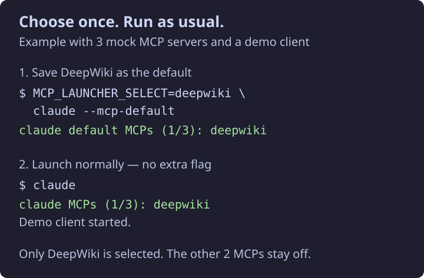

# MCP Launcher

**Choose your MCP tools once. Use Claude Code and Codex as usual.**

MCP servers give coding agents extra tools, such as documentation search.
MCP Launcher lets you choose which of your configured servers to enable.
It saves a separate default for Claude Code and Codex, then applies it whenever
you run `claude` or `codex`. No extra flag or menu each time.

For example, select only DeepWiki as your default. Your next plain launch uses
DeepWiki and disables the other discovered MCPs. You can open a picker whenever
you need a different set for a project.



*Example with mock servers and a demo client, using the real launcher.
The first command selects DeepWiki without opening the picker. Codex uses the
same controls; replace `claude` with `codex`.*

## Install and choose your defaults

You need Python 3.11+, Git, Make, Bash or Zsh, and at least one of Claude Code
or Codex CLI installed. Configure your MCP servers in that client first;
this tool selects servers but does not install them.

```bash
git clone https://github.com/testy-cool/mcp-launcher.git
cd mcp-launcher
make doctor
```

For **Zsh**:

```bash
make install
source ~/.zshrc
```

For **Bash**:

```bash
make install SHELL_RC="$HOME/.bashrc"
source ~/.bashrc
```

Choose defaults for each client you use. Skip the other command if you only
use one client:

```bash
claude --mcp-default
codex --mcp-default
```

With optional [gum](https://github.com/charmbracelet/gum) installed, press Space
to select servers and Enter to save. Without gum, enter server numbers separated
by commas. Each command saves your choices and exits.

Now run your usual commands, in any folder:

```bash
claude
codex
```

**Until you save a default, plain launches disable all discovered MCPs** and
show a setup hint. Existing client settings and saved folder choices are not
imported as defaults when you update. An intentionally empty default keeps all
MCPs disabled without showing the hint.

The installer adds shell functions to your startup file and installs under
`~/.local`. It preserves the rest of your shell configuration. Run `make dry-run`
to preview installation without changing anything.

## Change tools for a project

Open the picker and launch with your selection:

```bash
claude --mcp-launcher
codex --mcp-launcher
```

The picker remembers your choice for that folder. To use it again without a menu:

```bash
claude --mcp-last
codex --mcp-last
```

Plain `claude` and `codex` still use your global defaults. They do not erase
saved folder choices. Defaults are separate for the two clients.

These controls work with either client:

| Control | What it does |
| --- | --- |
| `--mcp-default` | Choose the default for every plain launch, then exit. |
| `--mcp-launcher` | Pick servers, save the folder choice, and launch. |
| `--mcp-last` | Use the saved folder choice, or the default if none exists. |
| `--mcp-none` | Disable all discovered MCPs for this launch and save that folder choice. |
| `--mcp-all` | Enable all discovered MCPs and save that folder choice. |
| `--mcp-use-default` | Use the default and also save it as the folder choice. |
| `--mcp-order` | Change the saved picker order, then exit. |
| `--mcp-refresh` | Refresh Claude.ai connector discovery and open the picker. |
| `--mcp-help` | Show launcher help. |

Other arguments pass through to the real CLI. Running sessions are not changed.

For scripts, `MCP_LAUNCHER_SELECT` overrides the selection. It accepts `all`,
`none`, or comma-separated names of servers you have already configured:

```bash
MCP_LAUNCHER_SELECT=none codex --version
```

## Resume a session

Use your normal resume command, such as `claude --continue` or
`codex resume --last`. When the launcher can identify the saved session, it
restores that session's first recorded permission settings. Permission flags you
supply yourself take precedence. This can restore unrestricted permissions if
that is how the session began.

Exact session IDs and names are supported too. If the CLI opens its own session
picker, the launcher cannot know which session you will choose, so it leaves
permission settings alone.

## Settings and privacy

Preferences live in `~/.config/mcp-launcher/state.json`. Use the commands above
to change them. The file stores server names, picker order, defaults, and folder
paths; it is readable and writable only by your user account.

The launcher reads your existing MCP configuration. It does not copy credentials,
server definitions, or session transcripts into its preference file.

- **Claude:** selection updates Claude's settings for the current project.
  Those settings can also affect later launches outside this wrapper.
- **Codex:** selection is passed as command-line settings for that launch.
- **Resume:** permission settings are read from the client's own session files.

### Optional: project secrets from 1Password

On systems with an unlocked GNOME keyring, a project can use a `.env.op` file
with 1Password references. This requires `op`, `gdbus`, `secret-tool`, and a
read-only 1Password service account.

Store the service account token in the keyring using this command, then enter
the token at its prompt:

```bash
secret-tool store --label="1Password service account - Claude and Codex" \
  application mcp-launcher credential op-service-account
```

Use references in `.env.op`, not real secret values. For example, replace this
placeholder with a reference from your vault:

```dotenv
SERVICE_TOKEN="op://Example Vault/Example Item/credential"
```

The launcher uses the nearest `.env.op` within the Git repository. It stops if
the keyring is locked or unavailable. It removes the service account token before
starting the agent; the resolved project secrets are available to that process.
Do not commit real tokens or private vault references to a public repository.

## Bypass, update, or remove

If discovery fails, or you want to skip the installed shell functions:

```bash
command claude
command codex
```

These run the native client with its own settings, without launcher selection,
secret loading, or permission recovery. You can also use them for native help
and version commands.

Update from your checkout:

```bash
git pull --ff-only
make install
```

For Bash, add `SHELL_RC="$HOME/.bashrc"` to install and uninstall commands.
Remove the launcher while keeping preferences:

```bash
make uninstall
```

To delete preferences too, use `./uninstall.sh --purge` (add
`--shell-rc "$HOME/.bashrc"` for Bash).

For a custom location, set `PREFIX` and `SHELL_RC` on the Make command, and use
the same values when updating or removing the launcher.

## Development

The launcher uses Python's standard library, with no Python packages to install.

```bash
make check
make doctor
make dry-run
```

Checks cover argument handling, defaults, folder choices, session permissions,
and installation/removal in a temporary home with test CLI programs. For a real
wrapper check after installation, run `claude --version` or `codex --version`.
This checks selection and CLI startup; it does not test requests to each MCP server.

Regenerate the mock example with `python3 docs/images/generate_demo.py`.
It uses a temporary home and never reads your client settings or credentials.

[MIT license](LICENSE).
